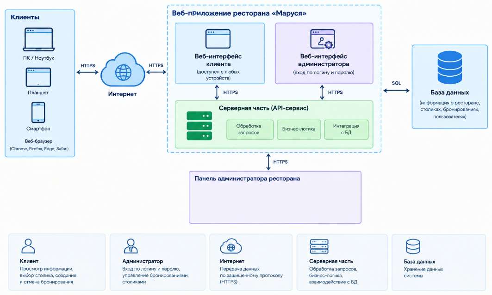

# Приложение для онлайн-бронирования столиков в ресторане
## 1 Общие сведения
## 1.1 Основание для выполнения работ
Программа развития сетей ресторанов.
## 1.2 Заказчик работ
Заказчик: Семейный ресторан "Маруся".
## 1.3 Цель выполнения работ
Работы по настоящему Договору выполняются с целью разработки и пилотного запуска веб-приложения, предоставляющего возможность онлайн-бронирования столиков в ресторане "Маруся".
## 1.4 Состав работ
По настоящему Договору Исполнитель выполняет перечисленные ниже работы:
1) разработка адаптивного веб-интерфейса для клиентов;
2) разработка веб-панели для администраторов ресторанов;
3) разработка серверной части приложения и API-сервиса для управления данными и бронированиями;
4) разработка базы данных для хранения информации о столиках, клиентах и бронированиях;
5) разработка технической документации.
## 1.5 Сроки выполнения работ
Срок выполнения работ - не более 90 дней с даты начала выполнения работ.
## 1.6 Место выполнения работ
Работы выполняются на территории Российской Федерации.
## 2 Назначение приложения для онлайн-бронирования столиков в ресторане
Веб-приложение для онлайн-бронирования столиков предназначено для предоставления клиентам ресторана "Маруся" возможности удаленного резервирования столиков с использованием веб-браузера.
Приложение должно предоставлять клиентам доступ к информации о ресторане, возможности выбора даты, времени и количества гостей, создания и отмены бронирования.
Для администраторов ресторана должно быть предусмотрено отдельное веб-интерфейсное средство, обеспечивающее просмотр информации о бронированиях и столиках.
Приложение должно обеспечивать разграничение доступа между клиентской и административной частью системы.
Веб-приложение должно быть адаптивным и обеспечивать возможность работы с персональных компьютеров, планшетов и мобильных устройств посредством современных веб-браузеров.
## 3 Описание услуги «Онлайн-бронирование столиков»
## 3.1 Схема предоставления услуги
Клиент посредством веб-браузера получает доступ к веб-приложению онлайн-бронирования столиков ресторана «Маруся». На главной странице приложения должна отображаться основная информация о ресторане, включая его наименование, адрес, часы работы и контактную информацию. Для выполнения бронирования клиент выбирает дату посещения, время и количество гостей. После этого система отображает столики, доступные для бронирования в выбранный период. Клиент выбирает подходящий столик, вводит необходимые контактные данные и подтверждает создание бронирования. После успешного создания бронирования система должна предоставить клиенту информацию о выполненной операции, включая дату, время, выбранный столик и идентификатор бронирования. Клиент должен иметь возможность отменить ранее созданное бронирование. Для отмены бронирования на главной странице приложения должна быть предусмотрена кнопка «Отменить бронирование», по нажатию на которую клиент вводит идентификатор бронирования, полученный им при подтверждении, и подтверждает отмену.
Администратор ресторана получает доступ к веб-интерфейсу администратора и может просматривать информацию о созданных бронированиях и занятости столиков.
## Рисунок 1. Схема предоставления услуги "Онлайн-бронирование столиков"

## 3.2 Архитектура системы
Система состоит из следующих компонентов:
1) веб-интерфейс клиента (адаптивный, доступен с любых устройств);
2) веб-интерфейс администратора ресторана;
3) серверная часть (API-сервис);
4) база данных.
Веб-интерфейс клиента предназначен для просмотра информации о ресторане, выбора параметров бронирования, просмотра доступных столиков, создания и отмены бронирований.
Веб-интерфейс администратора предназначен для просмотра и управления бронированиями, а также для работы с информацией о столиках ресторана.
Серверная часть приложения обеспечивает обработку запросов от клиентского и административного интерфейсов, выполнение бизнес-логики приложения и взаимодействие с базой данных.
API-сервис обеспечивает обмен данными между веб-интерфейсами и серверной частью приложения.
База данных предназначена для хранения информации о пользователях, столиках, бронированиях и других данных, необходимых для функционирования приложения.
Взаимодействие компонентов системы осуществляется через серверную часть приложения.
## Рисунок 2. Архитектура веб-приложения

## 3.3 Сценарий использования услуги
## 3.3.1 Просмотр информации о ресторане и о доступных столиках
| Поле | Содержание |
|---|---|
| **Действующие лица** | Клиент |
| **Объекты взаимодействия** | Веб-интерфейс клиента, API-сервис, база данных |
| **Предусловия** | Клиент открыл веб-приложение в браузере |
| **Инициируется** | Клиентом |
| **Нефункциональные требования** | Адаптивность интерфейса (ПК, планшет, мобильное устройство); корректное отображение в современных браузерах |
| **Основные шаги сценария** | 1) Клиент открывает главную страницу веб-приложения; 2) Система отображает основную информацию о ресторане: наименование, адрес, часы работы, контактные данные; 3) Клиент выбирает дату посещения, время и количество гостей; 4) Система направляет запрос в API-сервис для получения списка доступных столиков; 5) API-сервис обращается к базе данных и формирует список столиков, свободных на выбранные дату, время и количество гостей; 6) Система отображает клиенту список доступных столиков с указанием их параметров (вместимость, расположение и т.п.) |
| **Расширение сценария** | 4a) Если на выбранные дату/время/количество гостей нет свободных столиков — система выводит клиенту сообщение об отсутствии доступных столиков и предлагает изменить параметры поиска |
## 3.3.2 Бронирование столика клиентом
| Поле | Содержание |
|---|---|
| **Действующие лица** | Клиент |
| **Объекты взаимодействия** | Веб-интерфейс клиента, API-сервис, база данных |
| **Предусловия** | Клиент просмотрел список доступных столиков на выбранные дату, время и количество гостей (сценарий 3.3.1) |
| **Инициируется** | Клиентом |
| **Нефункциональные требования** | Адаптивность интерфейса; корректное отображение в современных браузерах |
| **Основные шаги сценария** | 1) Клиент выбирает подходящий столик из списка доступных; 2) Система отображает форму для ввода контактных данных клиента (имя, телефон); 3) Клиент вводит контактные данные и подтверждает создание бронирования; 4) Система направляет запрос в API-сервис на создание бронирования; 5) API-сервис повторно проверяет доступность выбранного столика на заданные дату и время; 6) API-сервис сохраняет данные о бронировании в базе данных и присваивает бронированию уникальный идентификатор; 7) Система отображает клиенту подтверждение выполненной операции с указанием даты, времени, выбранного столика и идентификатора бронирования |
| **Расширение сценария** | 5a) Если к моменту подтверждения выбранный столик уже забронирован другим клиентом — система выводит сообщение о том, что столик более недоступен, и предлагает выбрать другой; 3a) Если контактные данные введены некорректно (пустые поля, неверный формат) — система выводит сообщение об ошибке и не позволяет продолжить, пока данные не будут исправлены |
## 3.3.3 Отмена бронирования клиентом
| Поле | Содержание |
|---|---|
| **Действующие лица** | Клиент |
| **Объекты взаимодействия** | Веб-интерфейс клиента, API-сервис, база данных |
| **Предусловия** | У клиента есть ранее созданное действующее бронирование, известен его идентификатор (получен при подтверждении бронирования в сценарии 3.3.2) |
| **Инициируется** | Клиентом |
| **Нефункциональные требования** | Адаптивность интерфейса; корректное отображение в современных браузерах |
| **Основные шаги сценария** | 1) Клиент нажимает кнопку «Отменить бронирование» на главной странице; 2) Система отображает форму для ввода идентификатора бронирования; 3) Клиент вводит идентификатор бронирования; 4) Система направляет запрос в API-сервис для получения данных о бронировании по указанному идентификатору; 5) Система отображает клиенту информацию о найденном бронировании и предлагает подтвердить отмену; 6) Клиент подтверждает отмену бронирования; 7) Система направляет запрос в API-сервис на отмену бронирования; 8) API-сервис изменяет статус бронирования в базе данных на "отменено" и освобождает столик на соответствующие дату и время; 9) Система отображает клиенту подтверждение отмены бронирования |
| **Расширение сценария** | 4a) Если бронирование с указанным идентификатором не найдено — система выводит сообщение об ошибке; 7a) Если бронирование уже было отменено ранее или срок его действия истёк — система выводит сообщение о невозможности отмены |
## 3.3.4 Авторизация и аутентификация администратора
| Поле | Содержание |
|---|---|
| **Действующие лица** | Администратор |
| **Объекты взаимодействия** | Веб-панель администратора, API-сервис, база данных |
| **Предусловия** | У администратора есть учётная запись в системе |
| **Инициируется** | Администратором |
| **Нефункциональные требования** | Разграничение доступа между клиентской и административной частью системы |
| **Основные шаги сценария** | 1) Администратор открывает страницу авторизации веб-панели администратора; 2) Администратор вводит логин и пароль; 3) Система направляет данные в API-сервис для проверки; 4) API-сервис сверяет введённые данные с данными в базе данных; 5) При успешной проверке система предоставляет администратору доступ к веб-панели администратора |
| **Расширение сценария** | 4a) Если введены неверные логин или пароль — система выводит сообщение об ошибке и предлагает повторить ввод |
## 3.3.5 Просмотр броней администратором
| Поле | Содержание |
|---|---|
| **Действующие лица** | Администратор |
| **Объекты взаимодействия** | Веб-панель администратора, API-сервис, база данных |
| **Предусловия** | Администратор авторизован в веб-панели администратора (сценарий 3.3.4) |
| **Инициируется** | Администратором |
| **Нефункциональные требования** | Разграничение доступа между клиентской и административной частью системы |
| **Основные шаги сценария** | 1) Администратор открывает раздел просмотра бронирований в веб-панели администратора; 2) Система направляет запрос в API-сервис на получение списка бронирований; 3) API-сервис обращается к базе данных и формирует список текущих бронирований с данными о столиках, дате, времени и контактах клиентов; 4) Система отображает администратору список бронирований и информацию о занятости столиков |
| **Расширение сценария** | 3a) Если бронирований нет — система выводит сообщение об их отсутствии |
