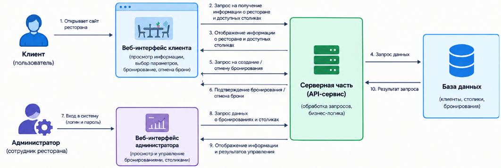

# Приложение для онлайн-бронирования столиков в ресторане
## 1 Общие сведения
## 1.1 Основание для выполнения работ
Программа развития сетей ресторанов.
## 1.2 Заказчик работ
Заказчик: Семейный ресторан "Маруся".
## 1.3 Цель выполнения работ
Работы по настоящему Договору выполняются с целью разработки и пилотного запуска веб-приложения, предоставляющего возможность онлайн-бронирования столиков в ресторане "Маруся".
## 1.4 Состав работ
По настоящему Договору Исполнитель выполняет перечисленные ниже работы:
1) разработка адаптивного веб-интерфейса для клиентов;
2) разработка веб-панели для администраторов ресторанов;
3) разработка серверной части приложения и API-сервиса для управления данными и бронированиями;
4) разработка базы данных для хранения информации о столиках, клиентах и бронированиях;
5) разработка технической документации.
## 1.5 Сроки выполнения работ
Срок выполнения работ - не более 90 дней с даты начала выполнения работ.
## 1.6 Место выполнения работ
Работы выполняются на территории Российской Федерации.
## 2 Назначение приложения для онлайн-бронирования столиков в ресторане
Веб-приложение для онлайн-бронирования столиков предназначено для предоставления клиентам ресторана "Маруся" возможности удаленного резервирования столиков с использованием веб-браузера.
Приложение должно предоставлять клиентам доступ к информации о ресторане, возможности выбора даты, времени и количества гостей, создания и отмены бронирования.
Для администраторов ресторана должно быть предусмотрено отдельное веб-интерфейсное средство, обеспечивающее просмотр информации о бронированиях и столиках.
Приложение должно обеспечивать разграничение доступа между клиентской и административной частью системы.
Веб-приложение должно быть адаптивным и обеспечивать возможность работы с персональных компьютеров, планшетов и мобильных устройств посредством современных веб-браузеров.
## 3 Описание услуги «Онлайн-бронирование столиков»
## 3.1 Схема предоставления услуги
Клиент посредством веб-браузера получает доступ к веб-приложению онлайн-бронирования столиков ресторана «Маруся». На главной странице приложения должна отображаться основная информация о ресторане, включая его наименование, адрес, часы работы и контактную информацию. Для выполнения бронирования клиент выбирает дату посещения, время и количество гостей. После этого система отображает столики, доступные для бронирования в выбранный период. Клиент выбирает подходящий столик, вводит необходимые контактные данные и подтверждает создание бронирования. После успешного создания бронирования система должна предоставить клиенту информацию о выполненной операции, включая дату, время, выбранный столик и идентификатор бронирования. Продолжительность одного бронирования в основной версии приложения составляет 2 часа.
Клиент должен иметь возможность отменить ранее созданное бронирование. Для отмены бронирования на главной странице приложения должна быть предусмотрена кнопка «Отменить бронирование», по нажатию на которую клиент вводит идентификатор бронирования, полученный им при подтверждении, и подтверждает отмену.
Администратор ресторана получает доступ к веб-интерфейсу администратора и может просматривать информацию о созданных бронированиях и занятости столиков.
## Рисунок 1. Схема предоставления услуги "Онлайн-бронирование столиков"

## 3.2 Архитектура системы
Система состоит из следующих компонентов:
1) веб-интерфейс клиента (адаптивный, доступен с любых устройств);
2) веб-интерфейс администратора ресторана;
3) серверная часть (API-сервис);
4) база данных.
Веб-интерфейс клиента предназначен для просмотра информации о ресторане, выбора параметров бронирования, просмотра доступных столиков, создания и отмены бронирований.
Веб-интерфейс администратора предназначен для просмотра и управления бронированиями, а также для работы с информацией о столиках ресторана.
Серверная часть приложения обеспечивает обработку запросов от клиентского и административного интерфейсов, выполнение бизнес-логики приложения и взаимодействие с базой данных.
API-сервис обеспечивает обмен данными между веб-интерфейсами и серверной частью приложения.
База данных предназначена для хранения информации об администраторах, столиках, бронированиях и контактных данных клиентов, необходимых для функционирования приложения.
## Рисунок 2. Архитектура веб-приложения

## 3.3 Сценарий использования услуги
## 3.3.1 Просмотр информации о ресторане и о доступных столиках
| Поле | Содержание |
|---|---|
| **Действующие лица** | Клиент |
| **Объекты взаимодействия** | Веб-интерфейс клиента, API-сервис, база данных |
| **Предусловия** | Клиент открыл веб-приложение в браузере |
| **Инициируется** | Клиентом |
| **Нефункциональные требования** | Адаптивность интерфейса (ПК, планшет, мобильное устройство); корректное отображение в современных браузерах |
| **Основные шаги сценария** | 1) Клиент открывает главную страницу веб-приложения; 2) Система отображает основную информацию о ресторане: наименование, адрес, часы работы, контактные данные; 3) Клиент выбирает дату посещения, время и количество гостей; 4) Система направляет запрос в API-сервис для получения списка доступных столиков; 5) API-сервис обращается к базе данных и формирует список столиков, свободных на выбранные дату, время и количество гостей; 6) Система отображает клиенту список доступных столиков с указанием их параметров (вместимость, расположение и т.п.) |
| **Расширение сценария** | 4a) Если на выбранные дату/время/количество гостей нет свободных столиков — система выводит клиенту сообщение об отсутствии доступных столиков и предлагает изменить параметры поиска |
## 3.3.2 Бронирование столика клиентом
| Поле | Содержание |
|---|---|
| **Действующие лица** | Клиент |
| **Объекты взаимодействия** | Веб-интерфейс клиента, API-сервис, база данных |
| **Предусловия** | Клиент просмотрел список доступных столиков на выбранные дату, время и количество гостей (сценарий 3.3.1) |
| **Инициируется** | Клиентом |
| **Нефункциональные требования** | Адаптивность интерфейса; корректное отображение в современных браузерах |
| **Основные шаги сценария** | 1) Клиент выбирает подходящий столик из списка доступных; 2) Система отображает форму для ввода контактных данных клиента (имя, телефон); 3) Клиент вводит контактные данные и подтверждает создание бронирования; 4) Система направляет запрос в API-сервис на создание бронирования; 5) API-сервис обращается к базе данных и формирует список столиков, которые имеют достаточную вместимость и свободны в выбранный двухчасовой период; 6) API-сервис сохраняет данные о бронировании в базе данных и присваивает бронированию уникальный идентификатор; 7) Система отображает клиенту подтверждение выполненной операции с указанием даты, времени, выбранного столика и идентификатора бронирования |
| **Расширение сценария** | 5a) Если к моменту подтверждения выбранный столик уже забронирован другим клиентом — система выводит сообщение о том, что столик более недоступен, и предлагает выбрать другой; 3a) Если контактные данные введены некорректно (пустые поля, неверный формат) — система выводит сообщение об ошибке и не позволяет продолжить, пока данные не будут исправлены |
## 3.3.3 Отмена бронирования клиентом
| Поле | Содержание |
|---|---|
| **Действующие лица** | Клиент |
| **Объекты взаимодействия** | Веб-интерфейс клиента, API-сервис, база данных |
| **Предусловия** | У клиента есть ранее созданное действующее бронирование, известен его идентификатор (получен при подтверждении бронирования в сценарии 3.3.2) |
| **Инициируется** | Клиентом |
| **Нефункциональные требования** | Адаптивность интерфейса; корректное отображение в современных браузерах |
| **Основные шаги сценария** | 1) Клиент нажимает кнопку «Отменить бронирование» на главной странице; 2) Система отображает форму для ввода идентификатора бронирования; 3) Клиент вводит идентификатор бронирования; 4) Система направляет запрос в API-сервис для получения данных о бронировании по указанному идентификатору; 5) Система отображает клиенту информацию о найденном бронировании и предлагает подтвердить отмену; 6) Клиент подтверждает отмену бронирования; 7) Система направляет запрос в API-сервис на отмену бронирования; 8) API-сервис изменяет статус бронирования в базе данных на "отменено" и освобождает столик на соответствующие дату и время; 9) Система отображает клиенту подтверждение отмены бронирования |
| **Расширение сценария** | 4a) Если бронирование с указанным идентификатором не найдено — система выводит сообщение об ошибке; 7a) Если бронирование уже было отменено ранее или срок его действия истёк — система выводит сообщение о невозможности отмены |
## 3.3.4 Авторизация и аутентификация администратора
| Поле | Содержание |
|---|---|
| **Действующие лица** | Администратор |
| **Объекты взаимодействия** | Веб-панель администратора, API-сервис, база данных |
| **Предусловия** | У администратора есть учётная запись в системе |
| **Инициируется** | Администратором |
| **Нефункциональные требования** | Разграничение доступа между клиентской и административной частью системы |
| **Основные шаги сценария** | 1) Администратор открывает страницу авторизации веб-панели администратора; 2) Администратор вводит логин и пароль; 3) Система направляет данные в API-сервис для проверки; 4) API-сервис сверяет введённые данные с данными в базе данных; 5) При успешной проверке система предоставляет администратору доступ к веб-панели администратора |
| **Расширение сценария** | 4a) Если введены неверные логин или пароль — система выводит сообщение об ошибке и предлагает повторить ввод |
## 3.3.5 Просмотр броней администратором
| Поле | Содержание |
|---|---|
| **Действующие лица** | Администратор |
| **Объекты взаимодействия** | Веб-панель администратора, API-сервис, база данных |
| **Предусловия** | Администратор авторизован в веб-панели администратора (сценарий 3.3.4) |
| **Инициируется** | Администратором |
| **Нефункциональные требования** | Разграничение доступа между клиентской и административной частью системы |
| **Основные шаги сценария** | 1) Администратор открывает раздел просмотра бронирований в веб-панели администратора; 2) Система направляет запрос в API-сервис на получение списка бронирований; 3) API-сервис обращается к базе данных и формирует список текущих бронирований с данными о столиках, дате, времени и контактах клиентов; 4) Система отображает администратору список бронирований и информацию о занятости столиков |
| **Расширение сценария** | 3a) Если бронирований нет — система выводит сообщение об их отсутствии |
## 4 Требования к системе
## 4.1 Функциональные требования
Приложение должно предоставлять клиентам и администраторам ресторана следующие функциональные возможности.
### 4.1.1 Просмотр информации о ресторане
Клиент должен иметь возможность просматривать основную информацию о ресторане:
1) наименование ресторана;
2) адрес;
3) часы работы;
4) контактную информацию.
### 4.1.2 Просмотр доступных столиков
Клиент должен иметь возможность указать дату посещения, время посещения и количество гостей.
Система должна формировать список доступных столиков с учетом следующих условий:
1) вместимость столика должна быть не меньше указанного количества гостей;
2) столик не должен быть занят другим действующим бронированием в выбранный период времени.
Продолжительность одного бронирования в основной версии приложения составляет 2 часа.
Если подходящих столиков нет, система должна вывести соответствующее сообщение.
### 4.1.3 Создание бронирования
Клиент должен иметь возможность выбрать доступный столик и создать бронирование.
Для создания бронирования клиент вводит имя и номер телефона.
Дата, время, количество гостей и выбранный столик определяются на основании ранее выбранных параметров.
Перед созданием бронирования система должна повторно проверить доступность выбранного столика.
Если столик доступен, система должна:
1) сохранить бронирование в базе данных;
2) присвоить бронированию уникальный идентификатор;
3) вывести клиенту подтверждение создания бронирования.
Если выбранный столик уже занят другим бронированием, система не должна создавать новое бронирование и должна предложить клиенту выбрать другой столик.
### 4.1.4 Проверка конфликтов бронирования
Один и тот же столик не может иметь два действующих бронирования с пересекающимися временными интервалами.
Временные интервалы считаются конфликтующими, если они хотя бы частично пересекаются.
Если время окончания одного бронирования совпадает со временем начала другого бронирования, такие бронирования конфликтующими не считаются.
При создании бронирования система должна проверять его на пересечение с другими действующими бронированиями выбранного столика, само редактируемое бронирование в проверке пересечений не учитывается.
### 4.1.5 Отмена бронирования клиентом
Клиент должен иметь возможность отменить ранее созданное бронирование по его уникальному идентификатору.
После ввода идентификатора система должна найти соответствующее бронирование и отобразить информацию о нем.
После подтверждения отмены статус бронирования должен быть изменен на "отменено".
Отмененное бронирование не должно учитываться при определении доступности столика.
Если бронирование не найдено, уже было отменено или срок его действия истек, система должна вывести сообщение о невозможности отмены.
### 4.1.6 Авторизация и аутентификация администратора
Для доступа к административной части приложения администратор должен пройти авторизацию с использованием логина и пароля.
При успешной проверке данных система предоставляет доступ к веб-панели администратора.
При вводе неверного логина или пароля система должна вывести сообщение об ошибке и не предоставлять доступ к административной части.
### 4.1.7 Просмотр бронирований администратором
Администратор должен иметь возможность:
1) просматривать список бронирований;
2) просматривать информацию о каждом бронировании;
## 4.2 Нефункциональные требования
### 4.2.1 Требования к корректности данных
Приложение должно выполнять проверку вводимых пользователем данных.
Не должны сохраняться данные с незаполненными обязательными полями или недопустимыми значениями.
Количество гостей и вместимость столика должны быть положительными целыми числами.
Номер телефона клиента должен соответствовать допустимому формату.
Дата и время нового бронирования не должны находиться в прошлом.
### 4.2.2 Требования к пользовательскому интерфейсу
Приложение должно быть доступно пользователям посредством веб-браузера.
Интерфейс должен быть адаптивным и обеспечивать корректное отображение на персональных компьютерах, планшетах и мобильных устройствах.
При возникновении ошибок система должна выводить пользователю понятные сообщения.
### 4.2.3 Требования к сохранению данных
Информация о столиках, администраторах и бронированиях должна храниться в базе данных.
Информация о столиках включает в себя:
1) номер столика;
2) вместимость;
3) расположение или зона ресторана;
4) доступность столика.
Информация об администраторах включает в себя логин и пароль каждого администратора.
Информация о бронированиях включает в себя идентификатор бронирования.
Данные должны сохраняться после завершения работы и повторного запуска приложения.
Отмена бронирования не должна приводить к физическому удалению записи о нем из базы данных, статус бронирования должен измениться на "Отменено".
### 4.2.4 Требования к безопасности
Административная часть приложения должна быть недоступна неавторизованным пользователям.
Пароли администраторов не должны храниться в базе данных в открытом виде.
При возникновении ошибок пользователю не должна отображаться внутренняя техническая информация о системе.
### 4.2.5 Требования к структуре программного обеспечения
Приложение должно иметь модульную структуру.
Основные компоненты системы должны быть разделены таким образом, чтобы изменение одной функциональной части по возможности не требовало внесения несвязанных изменений в другие части приложения.
### 4.2.6 Требования к тестируемости
Основная функциональность приложения должна допускать автоматизированное тестирование.
Особое внимание должно уделяться проверке:
1) поиска доступных столиков;
2) соответствия вместимости столика количеству гостей;
3) создания бронирования;
4) пересечения временных интервалов;
5) повторной проверки доступности столика;
6) отмены бронирования;
7) запрета удаления столика с действующими бронированиями;
8) обработки некорректных входных данных.
## 4.3 Ограничения системы
В основной версии приложения:
1) обслуживается один ресторан;
2) клиентские учетные записи не создаются;
3) одно бронирование относится к одному столику;
4) продолжительность одного бронирования составляет 2 часа;
5) клиент самостоятельно выбирает конкретный доступный столик;
6) онлайн-оплата не предусматривается;
7) предварительный заказ блюд не предусматривается;
8) SMS- и email-уведомления не предусматриваются;
9) изменение бронирования не предусматривается;
10) используется одна административная роль;
11) мобильное приложение не разрабатывается.
